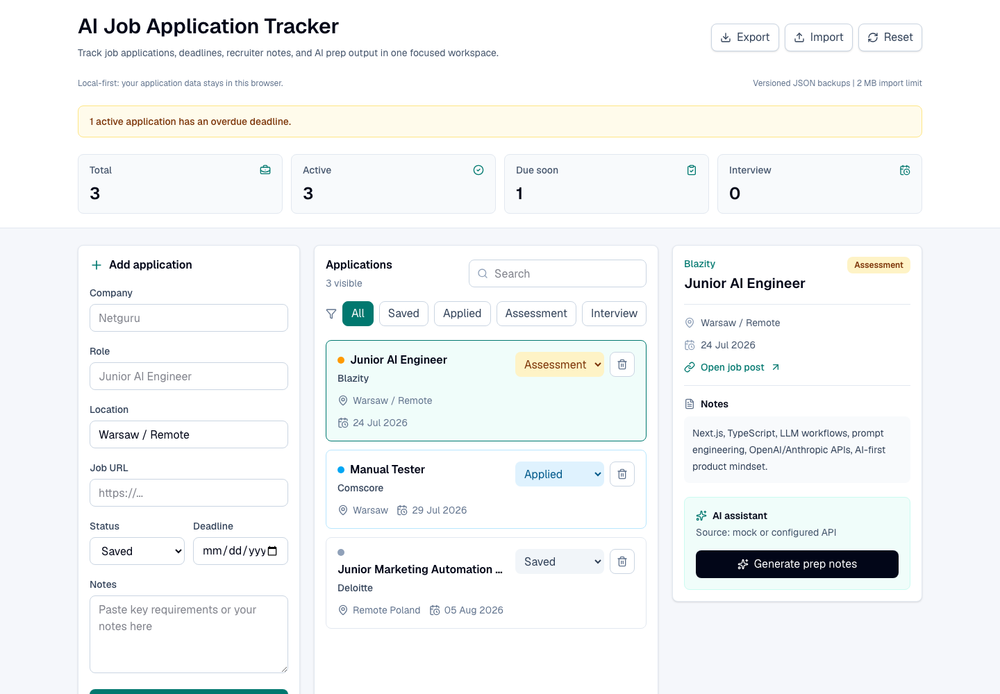

# AI Job Application Tracker

A portfolio-ready mini CRM for tracking job applications, deadlines, recruiter notes, and AI-assisted interview preparation.

The project is intentionally small but practical: it shows product thinking, TypeScript discipline, client-side persistence, API route handling, resilient AI fallback behavior, automated tests, and manual QA documentation.



## Highlights

- Add applications with company, role, location, URL, status, deadline, and notes.
- Search and filter the pipeline by status, role, company, location, and notes.
- Track useful metrics: total applications, active applications, due-soon deadlines, and interviews.
- Persist data in versioned `localStorage` with safe fallback for corrupted or unavailable storage.
- Export and restore versioned JSON backups with strict runtime validation and a 2 MB safety limit.
- Generate AI preparation notes with either a real OpenAI-compatible provider or a mock fallback.
- Normalize AI provider output before rendering it in the UI.
- Include automated tests, manual QA cases, a bug report template, and GitHub Actions CI.

## Tech Stack

- Next.js
- React
- TypeScript
- Tailwind CSS
- Vitest
- Oxlint
- localStorage
- OpenAI-compatible chat completions endpoint

## Getting Started

Install dependencies:

```bash
npm install
```

Run the development server:

```bash
npm run dev
```

Open:

```text
http://localhost:3000
```

## Optional AI Setup

The app works without an API key. In that case, the API route returns deterministic mock AI output.

To use a real OpenAI-compatible provider, create a `.env.local` file:

```bash
cp .env.example .env.local
```

Then add your values:

```env
OPENAI_API_KEY=your_api_key_here
OPENAI_BASE_URL=https://api.openai.com/v1
OPENAI_MODEL=gpt-4o-mini
```

Restart the development server after changing environment variables.

## Scripts

```bash
npm run dev
npm run lint
npm run typecheck
npm run test
npm run build
npm run check
```

## Project Structure

```text
.github/workflows/ci.yml       GitHub Actions verification workflow
docs/
  bug-report-template.md       Manual QA bug report template
  github-portfolio-plan.md     Suggested GitHub portfolio direction
  test-cases.md                Manual QA test cases
src/
  app/
    api/ai-assistant/route.ts  API route with real/mock AI logic
    globals.css               Global styles
    layout.tsx                 App metadata and layout
    page.tsx                   Main tracker UI
  lib/
    ai.ts                      AI prompt, mock result, provider call, normalization
    ai.test.ts                 AI normalization tests
    applications.ts            Application validation, filtering, storage, metrics
    applications.test.ts       Application utility tests
    sample-data.ts             Demo applications and status styles
  types.ts                     Shared TypeScript types
output/playwright/
  application-tracker-dashboard.png  Verified product screenshot
```

## Quality Notes

- Whitespace-only company or role values are rejected before a card is created.
- Corrupted `localStorage` data falls back to demo data instead of breaking the app.
- Invalid, unsupported, or oversized backup files are rejected without replacing current data.
- Failed AI provider calls fall back to mock output when a valid application is available.
- `npm audit` currently reports zero known vulnerabilities after dependency fixes and a `postcss` override.

## Portfolio Fit

This project is useful for junior AI, QA, support, CRM, product, and automation roles because it combines a realistic workflow with visible engineering hygiene: typed data models, input validation, persistence, API integration, fallback states, test coverage, and QA artifacts.

## CV Description

AI Job Application Tracker - built a Next.js and TypeScript mini CRM for managing job applications, deadlines, statuses, and recruiter notes. Added versioned JSON import/export, strict runtime validation, an AI assistant API route with mock fallback, localStorage resilience, unit tests, manual QA docs, and CI checks.

## Recruiter Demo Flow

1. Filter the pipeline by `Interview` and open an application.
2. Change its status and reload the page to demonstrate persistence.
3. Generate preparation notes to show the real/mock AI fallback.
4. Export a JSON backup, reset the demo, and import the backup again.
