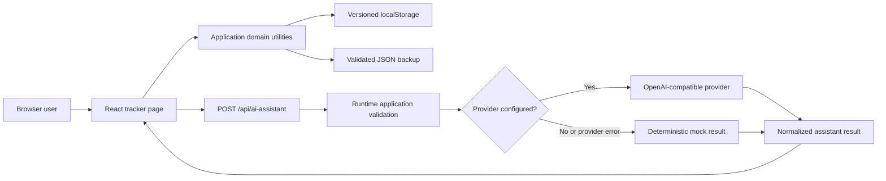

# AI Job Application Tracker

A Next.js portfolio project for managing a personal job-search pipeline and generating structured, AI-assisted preparation notes.

[](https://github.com/madara66613/ai-job-application-tracker/actions/workflows/ci.yml)

**Status:** Core workflows are implemented and tested. The project runs locally and is not currently hosted as a public demo.


## Problem

Job-search details often end up split across bookmarks, spreadsheets, and notes. This project brings application status, deadlines, recruiter notes, backups, and interview preparation into one focused interface while demonstrating full-stack-oriented product thinking without claiming a production backend.

## Implemented Features

- Add applications with company, role, location, source URL, status, deadline, and notes.
- Search across company, role, location, and notes, and filter by pipeline status.
- Calculate total, active, due-soon, overdue, and interview-focused views.
- Persist records in versioned browser `localStorage`, with safe recovery from corrupted data.
- Export and restore versioned JSON backups with runtime validation and a 2 MB import limit.
- Call a Next.js API route for AI-assisted recruiter messages, requirements, CV skills, and interview tasks.
- Use an OpenAI-compatible chat-completions provider when configured.
- Fall back to deterministic mock output when no key is configured or the provider fails.
- Normalize provider output before it reaches the UI.
- Verify domain and AI behavior with Vitest and run lint, typecheck, tests, and build in CI.

## Technical Stack

- Next.js 16, React 19, and TypeScript
- Tailwind CSS
- Next.js App Router and route handlers
- Browser `localStorage` and JSON backup files
- OpenAI-compatible chat-completions API
- Vitest, Oxlint, and GitHub Actions

## Architecture



Application records remain in the browser. A selected application is sent to the local Next.js route only when the user requests preparation notes; it reaches an external provider only when provider credentials are configured.

## Testing and Quality

`npm run check` executes:

1. Oxlint
2. TypeScript validation
3. Vitest
4. Next.js production build

The tests cover application validation and creation, filtering, deadline metrics, storage recovery, backup validation, AI fallback generation, and provider-response normalization. Manual test cases and a reusable bug-report template are available in [`docs/`](docs/).

## Local Setup

Requirements: Node.js 22 and npm.

```bash
git clone https://github.com/madara66613/ai-job-application-tracker.git
cd ai-job-application-tracker
npm install
npm run dev
```

Open [http://localhost:3000](http://localhost:3000).

### Optional AI provider

The app works without an API key by returning deterministic demo output.

```bash
cp .env.example .env.local
```

```env
OPENAI_API_KEY=your_api_key_here
OPENAI_BASE_URL=https://api.openai.com/v1
OPENAI_MODEL=gpt-4o-mini
```

Restart the development server after changing environment variables. Do not commit `.env.local`.

## Available Commands

| Command | Purpose |
| --- | --- |
| `npm run dev` | Start the local development server |
| `npm run lint` | Run Oxlint |
| `npm run typecheck` | Validate TypeScript without emitting files |
| `npm run test` | Run Vitest once |
| `npm run build` | Create a production Next.js build |
| `npm run check` | Run the complete local/CI verification chain |

## Project Structure

```text
.github/workflows/ci.yml       CI verification
docs/
  bug-report-template.md       Manual QA bug-report template
  github-portfolio-plan.md     Current portfolio positioning
  test-cases.md                Manual QA cases
output/playwright/
  application-tracker-dashboard.png
src/
  app/
    api/ai-assistant/route.ts  Validated provider/fallback API route
    page.tsx                   Main product interface
  lib/
    ai.ts                      Prompting, provider call, normalization, fallback
    applications.ts            Validation, filtering, persistence, metrics, backup
    sample-data.ts             Clearly fictional demo applications
  types.ts                     Shared application and AI types
```

## Key Engineering Decisions

- **Local-first scope:** browser persistence keeps the portfolio project runnable without infrastructure while making the boundary clear.
- **Versioned backups:** import validation prevents malformed or unsupported data from replacing the current pipeline.
- **Resilient AI integration:** the user can demonstrate the complete flow without a paid service, while the same route supports a real compatible provider.
- **Normalized untrusted output:** provider JSON is treated as external input and cleaned before rendering.
- **Deterministic demo data:** sample applications use `example.com` URLs and do not represent real applications or company relationships.

## Known Limitations

- This is a single-browser portfolio application: there is no database, authentication, multi-user access, or cross-device synchronization.
- `localStorage` can be cleared by the browser; JSON export is the only backup mechanism.
- The provider integration expects a chat-completions-compatible endpoint that returns JSON text; it does not currently use provider-specific structured-output modes.
- Tests focus on domain and integration utilities; browser end-to-end coverage is not yet included.
- There is no public deployment or production monitoring.

## Roadmap

- Add Playwright coverage for the critical add, persist, export, import, and AI-fallback journeys.
- Add optional database-backed persistence and authentication as a separate, clearly scoped backend milestone.
- Deploy a public demo with mock AI enabled and publish a short walkthrough.
- Add provider timeout/retry handling and structured-output support where available.

## Recruiter Demo Flow

1. Filter the pipeline by `Interview` and inspect an application.
2. Add or update an application, reload, and show local persistence.
3. Generate preparation notes and point out whether the result came from the configured provider or deterministic fallback.
4. Export a JSON backup, reset the demo, and restore the backup.
5. Run `npm run check` to show the same verification chain used in CI.

## CV-Ready Description

Built a Next.js and TypeScript job-application CRM with validated local persistence, versioned JSON import/export, an AI assistant route with OpenAI-compatible provider support and deterministic fallback, automated tests, manual QA documentation, and GitHub Actions CI.

## License

No open-source license has been added. The source is public for portfolio review; normal copyright restrictions apply.
